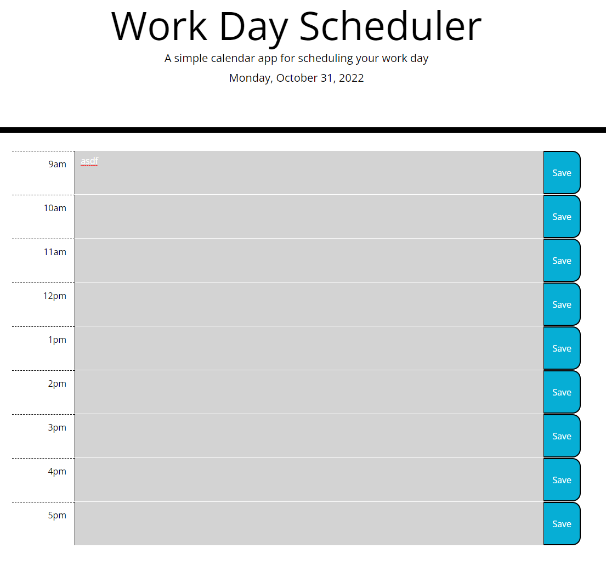

# work-day-scheduler

## Table of Contents

-   [Description](#description)
-   [Photos](#photos)
-   [License](#license)
-   [Deployed Page](#deployed-page)
-   [Contact](#contact)

## Description

As a University of Washington Coding Boot Camp student, I want to understand JavaScript, HTML, and CSS better to eventually create high-end websites for clients. I built this project to create a web-based day planner to help people their work days. I learned about using third party APIs and furthered my knowledge of DOM hooks and using JavaScript to change HTML.

## Photos

## Credits

None

## License

Please refer to the LICENSE in the repo.

## Deployed Page

<a href="https://vlad-kronk.github.io/work-day-scheduler/">Live Site</a>

## Contact

<a href="https://www.linkedin.com/in/jmeyers6/" >LinkedIn</a>

<a href="https://github.com/vlad-kronk">Github</a>
